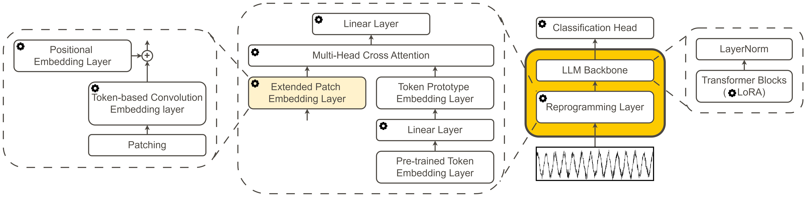

# LLM4TS
### LLMs for Range Prediction of Electric Trucks in Pre-Development Software and Electronics
 
An LLM-based architecture for multivariate time series classification in electric truck range prediction. Designed to replace per-vehicle ML models in pre-development software and electronics pipelines.
 


 

## Overview
 
Accurate range prediction for electric trucks is crucial for energy management, operational planning, and driver confidence in commercial electromobility. As electric truck fleets grow in size and variant diversity, the scalability of existing bespoke machine learning models becomes a critical limitation, each model must be individually maintained per vehicle variant.
 
Motivated by the rapid progress of foundation models in natural language processing and computer vision, this thesis investigates whether Large Language Models can be adapted to multivariate time series data to provide a **scalable and unified classification architecture** for electric truck applications.
 
To this end, **DeepRange** is introduced, a novel LLM-based architecture for multivariate time series classification. It treats range prediction as a **scenario classification problem**, applying large language model architectures to structured CAN signal data from electric trucks. Two candidate architectures with distinct data representation strategies are first compared on neutral multivariate time series classification benchmarks before being applied to the electric truck domain, ensuring that model selection remains free from domain-specific assumptions.
 
DeepRange is subsequently evaluated across three classification tasks, highway type, ambient temperature, and weather condition against the established baselines **InceptionTime** and **MiniRocket** across 12 experimental settings, covering two sequence lengths (100 s and 500 s) and two data regimes (full training set and a reduced 10% subset).
 
Results show that the **8B variant** achieves strong performance with sufficient data, while the **1B variant** offers the most favourable trade-off between classification performance and computational cost. The identified data thresholds, task-dependent performance patterns, and the architectural design of DeepRange provide a concrete foundation for integrating LLM-based multivariate time series classification into electric truck range prediction pipelines.
 
 
## Architecture
 
DeepRange builds on a pretrained LLM backbone and adapts it for time series with a **Reprogramming layer** to bridge the modality gap between time series patches and the language token space.


*Figure 1: DeepRange architecture.* 


## Quickstart

**1) Install dependencies**

```bash
pip install -r requirements.txt
```

**2) Run a single experiment**

Experiments are configured via [Hydra](https://hydra.cc) in the `config` folder. The entry point is `main.py` in the project root. Each config key maps to a scenario type, dataset size, and model variant.

```bash
# single run — highway scenario, 100 samples, 8B model
python main.py +experiment/highway=100_8B
```

**3) Run multiple experiments**

```bash
# multirun — sweeps over multiple configs in parallel
python main.py --multirun +experiment/highway=500_8B,500_1B
```

## Code Documentation
 
All relevant source code lives in the `src/` folder. Refer to the in-source documentation for module-level details:
 
> 📖 **[View Full Code Documentation](https://llm4ts.ilyass-afkir-023.workers.dev)**

## Model Variants

| Variant | Best for | Characteristics |
|---|---|---|
| **DeepRange-8B** | High-data settings | Strongest classification accuracy; larger compute footprint |
| **DeepRange-1B** | Efficiency-constrained settings | Competitive performance; significantly lower resource usage |

## Classification Tasks

DeepRange is evaluated on three scenario classification tasks:

- **Road type**: Classifies driving context (highway, urban, rural) from CAN time series patterns
- **Temperature**: Identifies thermal operating conditions that directly impact battery efficiency and range
- **Weather**: Detects environmental conditions (rain, snow, clear) from vehicle sensor signals

## Note on Electric Truck Data

This thesis was conducted in collaboration with **Daimler Truck AG**. The referenced `src/utils/can_signals.json` dataset contains proprietary CAN bus signal data and is **not distributed** with this repository for confidentiality reasons. Only signal names are exposed.

All public experiments and benchmarks use datasets from the **[UEA Time Series Classification Archive](http://www.timeseriesclassification.com/)**, which provides standardised multivariate time series benchmarks compatible with this framework.

## Note on the Use of AI Tools

In accordance with the guidelines of **Technische Universität Darmstadt**, AI tools were used to assist the work process and did not replace independent work.

The code in this repository was written independently and partially revised with the help of **ChatGPT** (OpenAI) and **Claude** (Anthropic). Revised sections are marked with a **Note** in the source code documentation. Docstrings follow the Google style and were written with assistance from Claude (Anthropic).

---

*Master's Thesis · 2025–2026 · Conducted at TU Darmstadt, Institute of Automotive Engineering (FZD) in collaboration with Daimler Truck AG*


